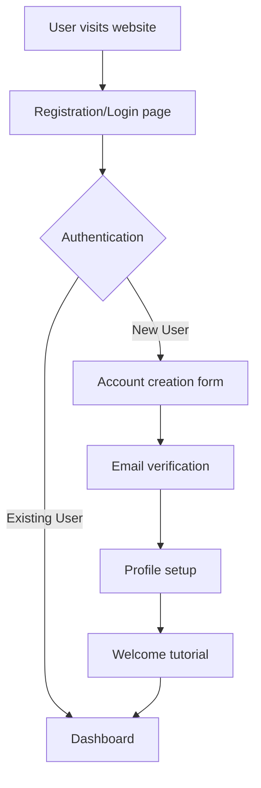
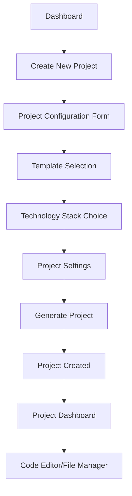
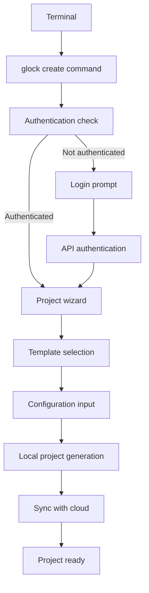
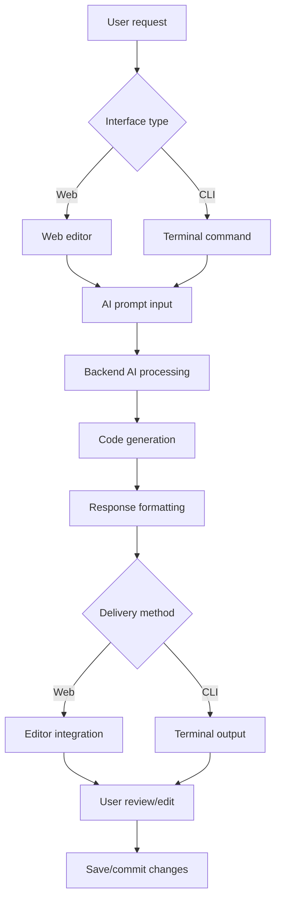
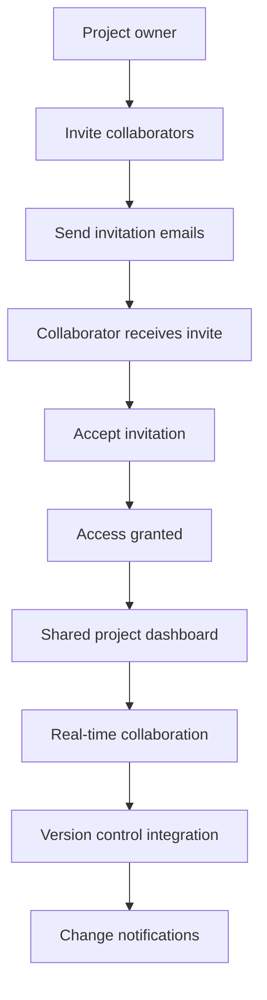

# User Flow Architecture

## Overview
This document outlines the complete user flow architecture for the Glock system, detailing how users interact with the platform and the flow of data through the system components.

## System Components

### 1. Frontend (Next.js)
- **Purpose**: User interface for web-based interactions
- **Technology**: Next.js 14+ with TypeScript, Tailwind CSS, shadcn/ui
- **Responsibilities**:
  - User authentication and session management
  - Interactive dashboard and project management
  - Real-time updates and notifications
  - File upload/download interface

### 2. Backend API (FastAPI)
- **Purpose**: Core business logic and API endpoints
- **Technology**: FastAPI with Python 3.11+
- **Responsibilities**:
  - Authentication and authorization
  - Project management and CRUD operations
  - File processing and storage
  - Integration with external services

### 3. CLI Application
- **Purpose**: Command-line interface for developers
- **Technology**: Python CLI with rich terminal UI
- **Responsibilities**:
  - Local project initialization
  - Code generation and scaffolding
  - Direct API communication
  - Development workflow automation

### 4. Database
- **Purpose**: Data persistence layer
- **Technology**: PostgreSQL (production) / SQLite (development)
- **Responsibilities**:
  - User data and preferences
  - Project metadata and configurations
  - Session and authentication tokens
  - Audit logs and analytics

## User Flow Scenarios

### Scenario 1: New User Onboarding



**Flow Steps:**
1. User accesses the web application
2. Presented with login/registration options
3. New users complete registration form with email/password
4. Email verification sent and confirmed
5. Initial profile setup (preferences, avatar, etc.)
6. Interactive tutorial showcasing key features
7. Redirect to main dashboard

### Scenario 2: Project Creation via Web Interface



**Flow Steps:**
1. User clicks "Create New Project" from dashboard
2. Fills out project configuration form (name, description, type)
3. Selects from available templates (React, FastAPI, Full-stack, etc.)
4. Chooses technology stack and dependencies
5. Configures project-specific settings
6. System generates project structure and files
7. Project created and user redirected to project dashboard
8. Access to integrated code editor and file management

### Scenario 3: CLI-Based Project Creation



**Flow Steps:**
1. User runs `glock create <project-name>` command
2. CLI checks for valid authentication token
3. If not authenticated, prompts for login credentials
4. Authenticates with backend API
5. Interactive wizard for project configuration
6. Template and technology stack selection
7. Local project files generated
8. Project synchronized with cloud backend
9. Development environment ready

### Scenario 4: Code Generation and AI Assistance



**Flow Steps:**
1. User initiates AI assistance (web editor or CLI command)
2. Provides natural language prompt or specific request
3. Request sent to backend AI processing service
4. AI generates appropriate code/solution
5. Response formatted for the requesting interface
6. Code presented to user for review
7. User can edit, accept, or request modifications
8. Changes saved to project and optionally committed to version control

### Scenario 5: Project Collaboration



**Flow Steps:**
1. Project owner sends collaboration invitations
2. Email invitations sent to collaborators
3. Collaborators accept invitations via email link
4. Access permissions granted based on role (viewer, editor, admin)
5. Shared project dashboard with role-based features
6. Real-time collaboration with live updates
7. Integrated version control for change tracking
8. Notifications for important project updates

## Data Flow Architecture

### Request/Response Flow

```
Client (Web/CLI) → Load Balancer → API Gateway → FastAPI Backend → Database
                                                ↓
                                          External Services
                                          (AI APIs, Git, etc.)
```

### Authentication Flow

```
1. User credentials → Backend validation → JWT token generation
2. Token stored in client (localStorage/CLI config)
3. Subsequent requests include Bearer token
4. Backend validates token on each request
5. Token refresh mechanism for long-lived sessions
```

### File Processing Flow

```
1. File upload → Temporary storage → Validation → Processing
2. Generated files → Version control → Permanent storage
3. Real-time updates → WebSocket notifications → Client updates
```

## Security Considerations

### Authentication & Authorization
- JWT-based authentication with refresh tokens
- Role-based access control (RBAC)
- API rate limiting and throttling
- Input validation and sanitization

### Data Protection
- Encryption at rest and in transit
- Secure file upload with virus scanning
- PII data handling compliance
- Regular security audits and updates

### Infrastructure Security
- HTTPS enforcement
- CORS configuration
- Environment variable management
- Database connection security

## Performance Optimization

### Caching Strategy
- Redis for session and frequently accessed data
- CDN for static assets and generated files
- Database query optimization with indexes
- API response caching for read-heavy operations

### Scalability Measures
- Horizontal scaling with load balancers
- Database read replicas
- Asynchronous task processing
- Microservices architecture for future expansion

## Monitoring & Analytics

### System Monitoring
- Application performance monitoring (APM)
- Database performance tracking
- Error logging and alerting
- Infrastructure monitoring (CPU, memory, disk)

### User Analytics
- User journey tracking
- Feature usage analytics
- Performance metrics (page load times, API response times)
- User feedback and satisfaction metrics

## Future Enhancements

### Planned Features
- Mobile application for iOS/Android
- Advanced AI capabilities and model selection
- Plugin system for third-party integrations
- Enterprise features (SSO, advanced security)

### Scalability Roadmap
- Kubernetes orchestration
- Multi-region deployment
- Advanced caching layers
- Machine learning pipeline optimization

## Technical Debt & Maintenance

### Regular Maintenance Tasks
- Dependency updates and security patches
- Database maintenance and optimization
- Log rotation and cleanup
- Performance profiling and optimization

### Code Quality Measures
- Automated testing (unit, integration, e2e)
- Code review processes
- Static code analysis
- Documentation updates

---

This architecture document serves as a living document that should be updated as the system evolves and new features are added.