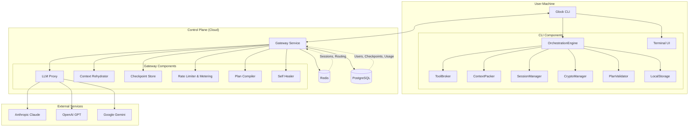
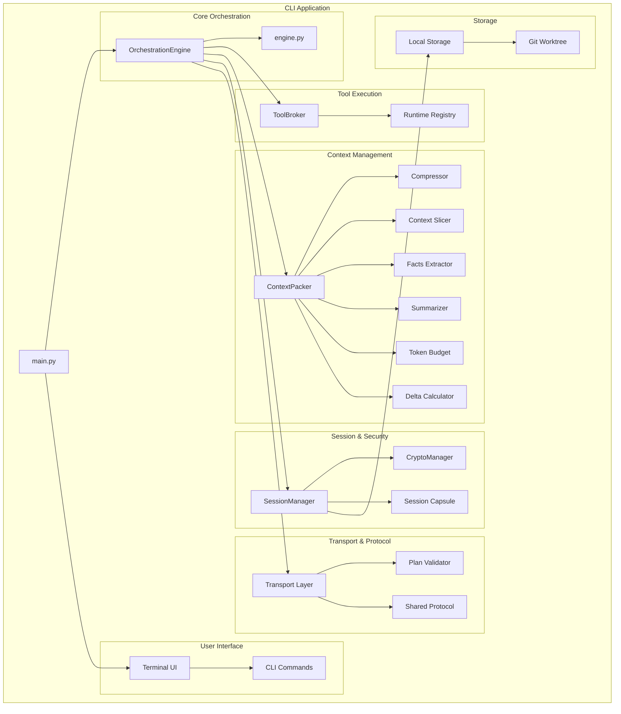
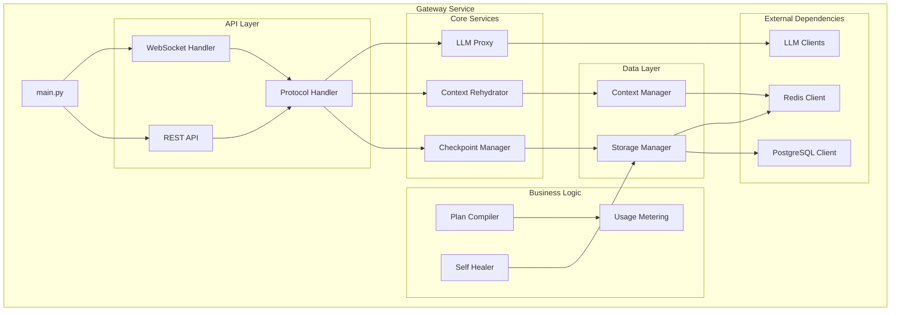
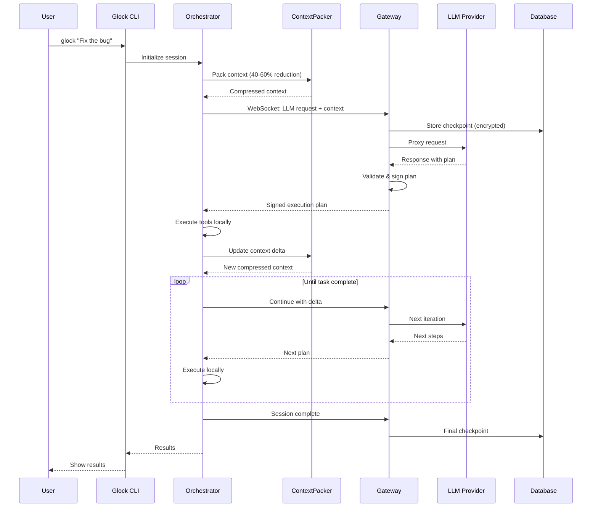
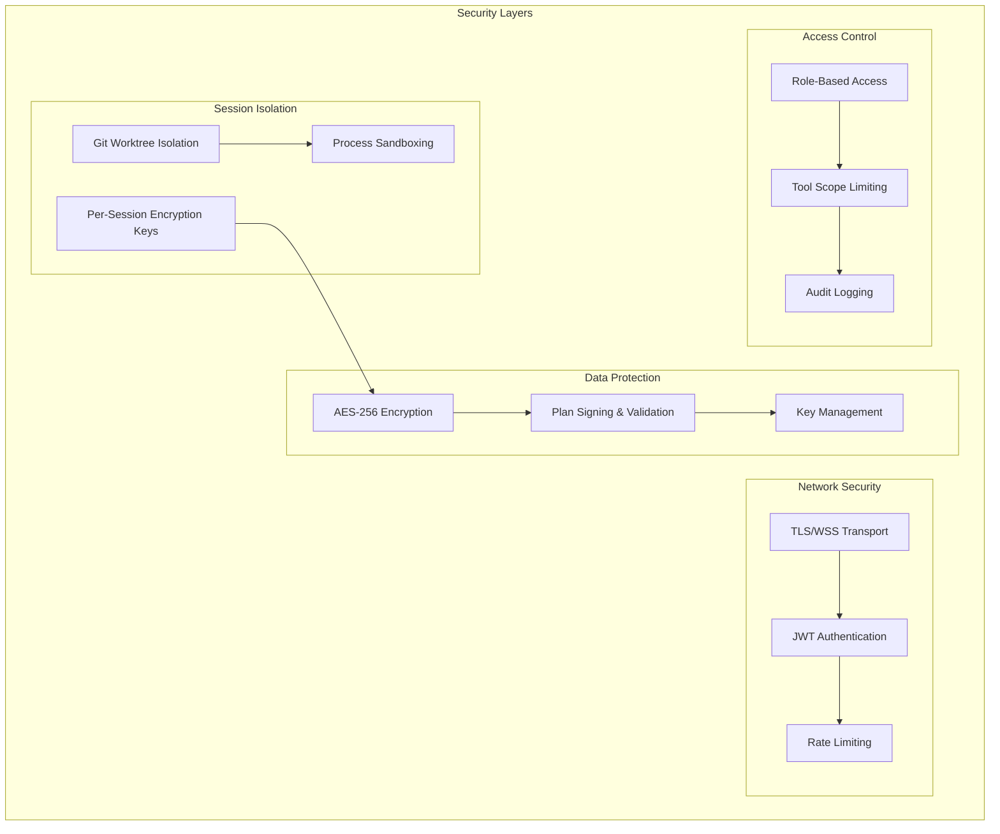
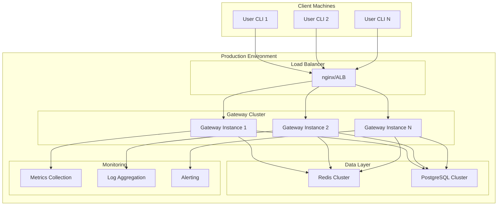

# Glock AI Coding Assistant - Architecture Diagram

## High-Level Architecture (Model B: Client-Orchestrated)

## Detailed Component Architecture

### Client-Side Components (CLI)

### Server-Side Components (Gateway)

## Data Flow Architecture

## Security & Isolation Architecture

## Deployment Architecture

## Key Architectural Principles

### 1. Client-Orchestrated Model
- **Full agent loop runs on client**: Orchestration, tool execution, context management
- **Server as stateless proxy**: Only handles LLM requests and checkpoint storage
- **Horizontal scaling**: No per-session server processes needed

### 2. Context Optimization
- **Token reduction**: 40-60% reduction through intelligent compression
- **Delta updates**: Only send context changes, not full history
- **Smart packing**: Facts extraction, summarization, and slicing

### 3. Security First
- **Per-session encryption**: Unique keys for each session
- **Workspace isolation**: Git worktrees prevent cross-contamination
- **Plan validation**: Server-signed execution plans prevent malicious code

### 4. Performance & Cost
- **Local execution**: File operations, git, bash run on user machine
- **Minimal server resources**: Stateless design enables cheap scaling
- **Efficient transport**: WebSocket with binary protocol for speed

### 5. Developer Experience
- **Zero configuration**: Works out of the box in any directory
- **Session continuity**: Encrypted checkpoints for pause/resume
- **Rich TUI**: Interactive terminal interface with real-time updates

## Technology Stack

### Client (CLI)
- **Language**: Python 3.11+
- **UI**: Rich TUI library
- **Crypto**: cryptography library (AES-256)
- **Transport**: WebSocket client
- **Tools**: Native OS tools (git, bash, etc.)

### Server (Gateway)
- **Framework**: FastAPI + uvicorn
- **Protocol**: WebSocket + REST API
- **Database**: PostgreSQL for persistence
- **Cache**: Redis for sessions
- **Deployment**: Docker + Kubernetes

### Shared
- **Protocol**: JSON Schema validated messages
- **Security**: JWT tokens, TLS encryption
- **Monitoring**: Structured logging, metrics

This architecture enables Glock to provide powerful AI coding assistance while maintaining security, performance, and cost-effectiveness through its innovative client-orchestrated design.